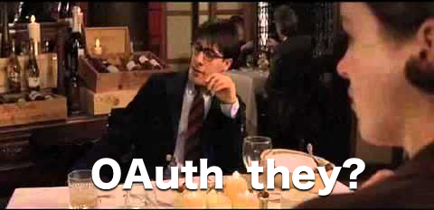

# OAuthThey



OAuthThey is a single purpose OAuth 1.0a implementation, specifically for use with Discogs.
It features modern Swift conventions and types, like `async` and Combine, and utilizes the latest Apple APIs, like the more modern `ASWebAuthenticationSession` for presenting web UI.

## Getting Started

OAuthThey uses the Swift Package Manager.
To include it in your project, just add it as a swift package dependency in XCode and `import OAuthThey` in any files that need to use it.

```swift
dependencies: [
    .package(url: "git@bitbucket.org:nrivard/oauththey.git", .upToNextMajor(from: "1.0.0")),
],
```

## Using OAuthThey

### The Client

To authenticate using OAuthThey, first create your `Client` and provide your configuration:

```swift
let config = Client.Configuration(
    consumerKey: consumerKey,
    consumerSecret: consumerSecret,
    userAgent: "OAuthTheyTester/1.0",
    keychainServiceKey: "OAuthTheyTester"
)

let client = Client(configuration: config)
```

### Requesting Authorization

Next, create your `AuthRequest` and provide an `ASPresentationAnchor` to present web UI from.
By default, `AuthRequest` uses `Platform.currentWindow` which is a provided convenience for getting the current window on iOS and macOS.  

```swift
let authRequest: Client.AuthRequest = .init(
    requestURL: URL(string: DiscogsOAuthEndpoints.requestURL)!,
    authorizeURL: URL(string: DiscogsOAuthEndpoints.authURL)!,
    accessTokenURL: URL(string: DiscogsOAuthEndpoints.accessToken)!,
    window: PlatformApplication.currentWindow
)
```

Call `startAuthorization` with your request on `Client`. 
This call is `async` and doesn't return a result, so you can call this on in any unattached task.
If authorization is successful, the valid `Token` will automatically be persisted to the Keychain using the given `keychainServiceKey` provided in the `Configuration`.

```swift
async {
    do {
        try await client.startAuthorization(with: authRequest)
    } catch {
        print(error)
    }
}
```

### Responding to Authorization Changes

To get notified when authentication status changes, subscribe to `authenticationPublisher`.

```swift
let client: Client

var body: some View {
    MainView()
        .onReceive(client.authenticationPublisher.receive(on: DispatchQueue.main)) { token in
            if let token = token {
                // logged in
            } else {
                // logged out
            }
        }
}
```

When creating a `Client`, if a valid `Token` is found in the Keychain, it will automatically start in an authenticated state.
The above Combine pipeline will "just work" and there should be no need to `startAuthorization`. 

### Signing Requests

Now that you're authenticated, you simply need to sign each request:

```swift
let request = URLRequest(url: Discogs.searchEndpoint)
client.authorizeRequest(&request)
```

OAuthThey will automatically include the proper OAuth headers on your request as well as `User-Agent`. You are responsible for `Content-Type`,  `Accepts`, and any other headers your service may require.

### Logging Out

Cleaning up when a user wants to log out is easy as well, including removing the persisted `Token` from the `Keychain`:

```swift
client.logout()
```

### Test Application

Included is a barebones test application, OAuthTheyTester, that you can use as a springboard for your own OAuth authentication.
You will need to fill out your own Discogs `consumerKey` and `consumerSecret` in `ContentView` if you want to test it.

## Notes

OAuthThey currently only supports `PLAINTEXT` signature methods and does not support expired tokens or other advanced OAuth features. This is a very barebones approach to OAuth for use with Discogs.
